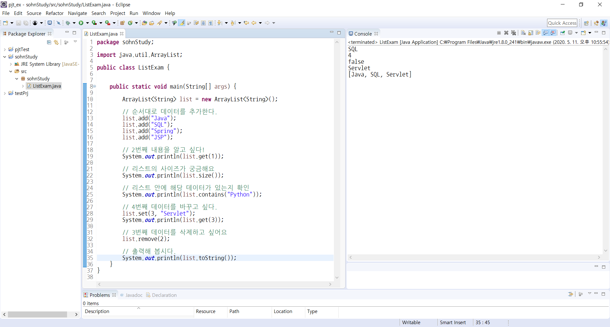
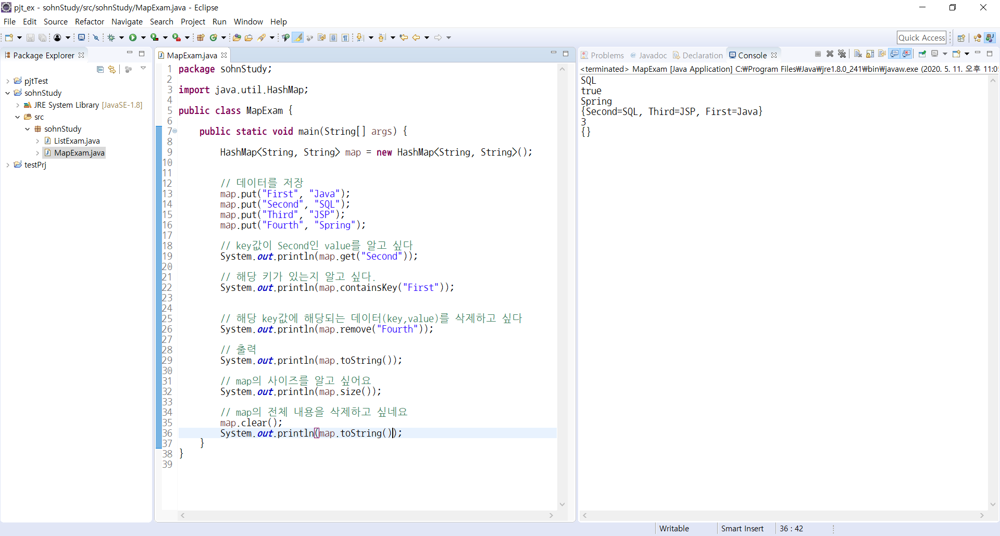

# SDH Study

## JAVAEE 
* 기본 플랫폼인 javase에서 웹 애플리케이션/ 서버에서 동작하게 추가된 자바 버전

## 웹 서버와 WAS의 차이점 
* 웹 서버는 정적인 컨텐츠를 다루고 WAS는 DB등의 동적인 컨텐츠를 다룬다.

## List와 Map의 특징
 
 1.  List는 각 데이터에 대한 위치가 있고 데이터 중복이 허용된다.  순서대로 들어오는 데이터를 담을때 유용하다

 2.  Map은 key와 value로 관리 key값은 중복이 되면 안되고 value는 key가 다르면 중복 가능

  List 예제

  Map 예제

## HTTP
### 1. 특징
http는 html문서등의 리소스를 다룰수 있게 해주는 프로토콜.  서버/클라이언트 모델이며 stateless의 특징을 가진다. 요청 메소드로 get post put delete head trace가 있다.

### 2. GET과 POST의 차이점
+ get 
서버로부터 정보를 조회하기 위해 설계

+ post
리소스를 생성 / 변경하기 위해 설계

>GET은 주소줄에 값이 ?뒤에 쌍으로 이어붙고 POST는 숨겨져서 보내진다.
GET은 URL에 이어붙기 때문에 길이제한이 있어서 많은양의 데이터는 보내기 어렵고 POST는 많은 양의 보내기에도 적합하다. GET은 가져오는 것이고 POST는 수행하는 것입니다.

>GET은 Select적인 성향을 가지고 있습니다. 
GET은 서버에서 어떤 데이터를 가져와서 보여준다거나 하는 용도이지 서버의 값이나 상태등을 바꾸지 않습니다

>POST는 서버의 값이나 상태를 바꾸기 위해서 사용합니다.

### 3. 응답 코드
- 200 OK; 요청이 성공했음을 나타내는 코드
- 302 Found; 클라이언트가 요청한 리소스가 Location 헤더에 주어진 URL에 일시적으로 이동되었음
 
- 401 Unauthorized; 해당 리소스에 유효한 인증 자격 증명이 없기 떄문에 요청이 적용되지 않았음

- 403 Forbidden; 서버에 요청이 전달되었지만, 권한 때문에 거절되었다는 것을 의미
- 404 Not Found; 서버가 요청받은 리소스를 찾을수 없다는 것을 의미
- 500 Internal Server Error; 요청을 처리하는 과정에서 서버가 예상하지 못한 상황에 놓였다는 것을 의미

